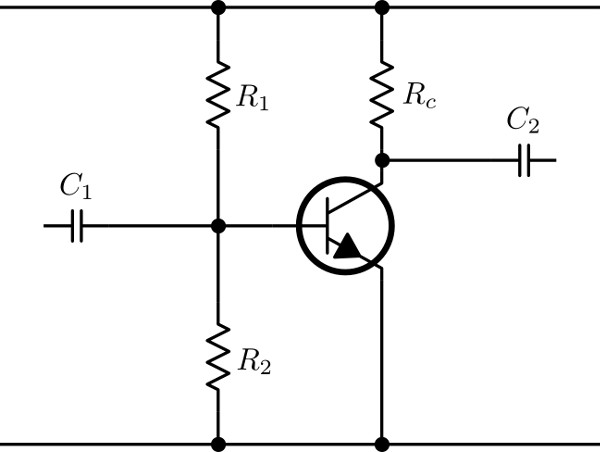

# ARRL Schematic Library for Inkscape
This library is based on the symbols used by ARRL in their books.

I have included a few symbols of my own: Sources, etc.

## Status
I am currently redrawing the most important symbols to fit the grid exactly. These are contained in the main file: [ArrlSchematic.svg](ArrlSchematic.svg).

Currently, there are 3 files
- [ArrlSchematic.svg](ArrlSchematic.svg): Complete redraw that fits the inkscape 1mm x 1mm grid (not yet complete).
- [600lib.svg](600lib.svg): Traced image modified to fit the grid a bit better.
- [600lib_noredraw.svg](600lib_noredraw.svg): Original traced image.

The first fits with a line width of 1 px. The latter two fit approximately with a line width of 0.9 px.

## Example

