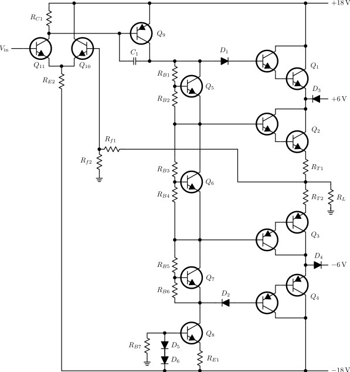

# ARRL Schematic Library for Inkscape
This library is traced from the image found [here](http://neazoi.com/arrlschem.htm "How to draw ARRL-style schematics by SV3ORA")

It is scaled to be used with the standard grid in Inkscape. For connecting the components, a line width of 0.9 px seems appropriate.

Some edges are a bit rounded which gives a bit of a raw/hand drawn look.

## Example

